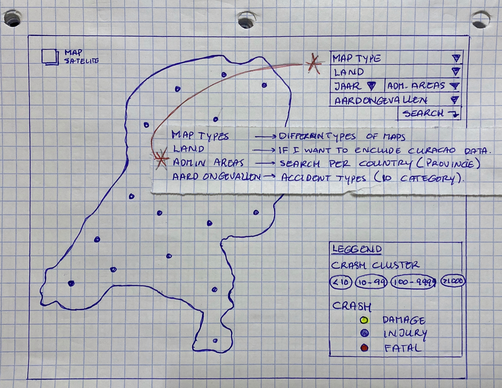

# The Interactive Road Accidents Map (The Netherlands)

## I. Introduction
Road accidents is a problem in every city. Minor accidents with material damage to major accidents with fatal consequences. According to the [World Health Organization (WHO)](https://www.who.int/news-room/fact-sheets/detail/road-Road-injuries), approximately 1.35 million people die from road accidents every year. In the Netherlands there are approximately 120.000 Road accidents, witch 650 die and in Curaçao 12.750 witch 17 die. Everyone wants a safe traffic, to accomplise this everybody has to be informed and be resposable. I want to contribute with a interactive web-map.

The last assignment of [New Maps Plus (Digital Mapping)](https://newmapsplus.as.uky.edu/) I designed and published a web map, which shows the traffic accidents in Utrecht, the Netherlands. The public can use this map to visualy find out how many accidents occur each year and where.

## II. Methodology
The file Accidents registered in the Netherlands is a file with the accident reports of the police linked to the digital road network. This data is intended to perform various road safety analyzes and made available by [Bestand geRegistreerde Ongevallen Nederland (BRON)](http://www.nationaalgeoregister.nl/geonetwork/srv/dut/catalog.search#/metadata/4gqrs90k-vobr-5t59-x726-4x2unrs1vawz). I will use the data: "Road accidents - Netherlands 2015-2018". 

I'm working with ratio data.
The main geometry I'm going to use is points that shows the location of the accidents, and also polygons for the administrative areas.

Tools used for data wrangler and management:
- Libre Office (spreadsheet)
- Postgress Database
- QGIS

### A. Data
After downloading the data (see **dataStructure.md**) I imported all csv files into a PostgreSQL database and created the table relations. With a sql-query, I made a selection of the data I need and exported it to a csv file, **VerkeersOngevallenNED_2009-2018.csv**.
QGIS was used to visualize the data and to export to GeoJSON.

Due to the high privacy sensitivity of the data, detailed attributes have been completely removed from the SOURCE by the owner:
- Party additions
- Victims
- Vehicle characteristic data
- Vehicle characteristics reference files (time, days, months, age classes ect.)
- License plates

[Datastructure](./dataStructure.md)

**Accident locations**

### B. Media for delivery
The map is a web browser-based application accessible across desktop devices.
HTML, CSS, SVG, JavaScript and leaflet were use to make the web application. Different library were used.

- [HTML Reference](https://developer.mozilla.org/en-US/docs/Web/HTML/Element)
- [CSS Reference](https://developer.mozilla.org/en-US/docs/Web/CSS/Reference)
- [JavaScript Reference](https://developer.mozilla.org/en-US/docs/Web/JavaScript)
- [Leaflet](https://leafletjs.com/)
- [Visual Studio Code](https://code.visualstudio.com/)
- [JQuery library](https://jquery.com/)
- [D3 library](https://d3js.org/)
- [Leaflet Sidebar](https://github.com/Turbo87/sidebar-v2)

### C. Application layout

### D. Thematic representation

#### Map realization
- Show all accident on map
  - Categorize per damages
  - and nature of the Accidents
- Slider, Let user swiftly slide through the years
- Overlay with other socio-demographic Data
  - population
  - Total road vehicles
  - alarms from the fire brigade

### E. User interaction
When opening or starting the application a standard map will project the type of accidents (Fatal, Injury and Properties damge). The user true scrolling the slidercontrol will interact with the web application. Selecting different parameters allows targeted filtering. The basic functions are also available to the users. Pan / Zoom and click on function to get more information.

### F. Conclusion
Traffic accidents remain a current topic. Governments around the world have taken steps to make traffic as safe as possible. But the main cause of most accidents remains the human factor. By providing as much information as possible about the status of road safety and the road user can be more responsible, that the accidents can become less and less.